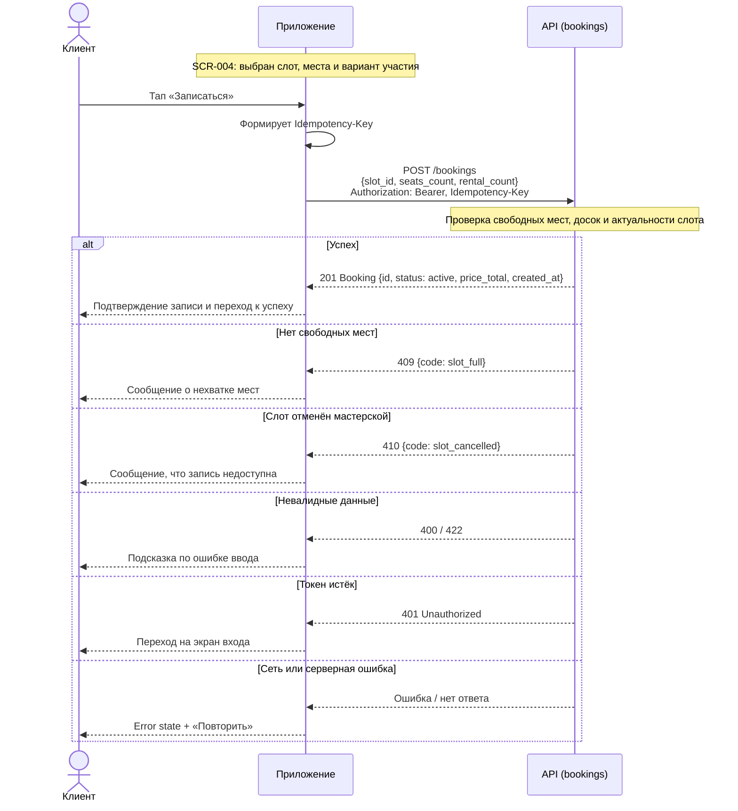
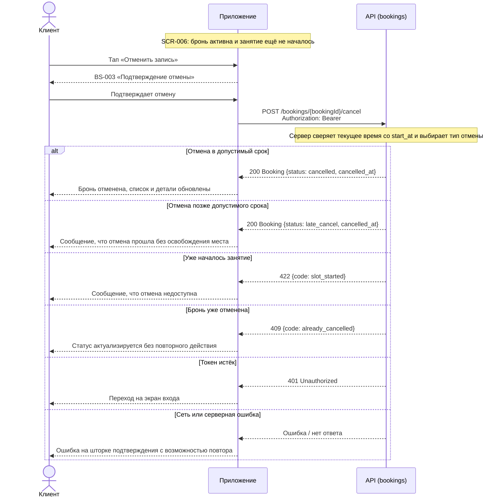

# Sequence-диаграмма API-взаимодействия

**Источники:**
[Use cases](../2-requirements/use-cases.md) ·
[Functional requirements](../2-requirements/functional-requirements.md) ·
[Business requirements](../2-requirements/business-requirements.md) ·
[SCR-004](../3-design-brief/SCR-004-booking.md) ·
[SCR-006](../3-design-brief/SCR-006-booking-details.md) ·
[data-model](data-model.md)

## Сквозные правила взаимодействия

- Все вызовы выполняются с `Authorization: Bearer <token>`.
- Сервер является источником истины по времени, доступности мест и состоянию брони.
- Запись и отмена выполняются атомарно.
- При ошибке сети или сервера пользователь должен получить понятное сообщение и возможность повторить действие.

## Сценарий 1: Создание брони

Поток: [SCR-004 «Оформление записи»](../3-design-brief/SCR-004-booking.md) → `POST /bookings` → [BS-002 «Подтверждение записи»](../3-design-brief/BS-002-booking-success.md).

Клиент отправляет `slot_id`, `seats_count` и `rental_count`. Итоговую стоимость `price_total` рассчитывает сервер, а клиент её только отображает.

| Шаг | Что происходит | Источник |
| :-- | :-- | :-- |
| Запрос | `POST /bookings` с `Idempotency-Key` | bookings API |
| Проверка | Сервер атомарно проверяет доступность и фиксирует цену | НФТ + домен |
| `201` | Возвращается `Booking` со статусом `active` | модель данных |
| `409` | Нет мест или конфликт состояния слота | use cases |
| `410` | Слот отменён мастерской | бизнес-правила |

## Сценарий 2: Отмена брони

Поток: [SCR-006 «Детали брони + отмена»](../3-design-brief/SCR-006-booking-details.md) → [BS-003 «Подтверждение отмены»](../3-design-brief/BS-003-cancel-confirm.md) → `POST /bookings/{bookingId}/cancel`.

Отмена доступна только до старта занятия. Сервер определяет итоговый тип отмены по времени до начала: ранняя или поздняя.

| Шаг | Что происходит | Источник |
| :-- | :-- | :-- |
| Запрос | `POST /bookings/{bookingId}/cancel` | bookings API |
| Решение | Сервер определяет `cancelled` или `late_cancel` | домен + use cases |
| `200` | Бронь получает новый статус и `cancelled_at` | модель данных |
| `422` | Отмена недоступна после старта | UC-2 |
| `409` | Повторная отмена | UC-2 |

> Полная модель состояний брони и слота — в [data-model.md](data-model.md).