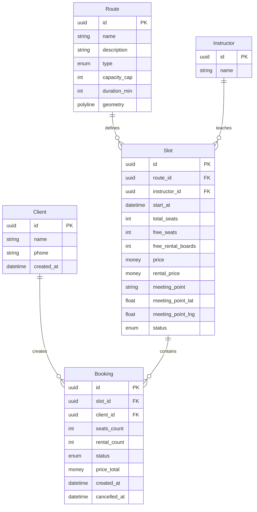
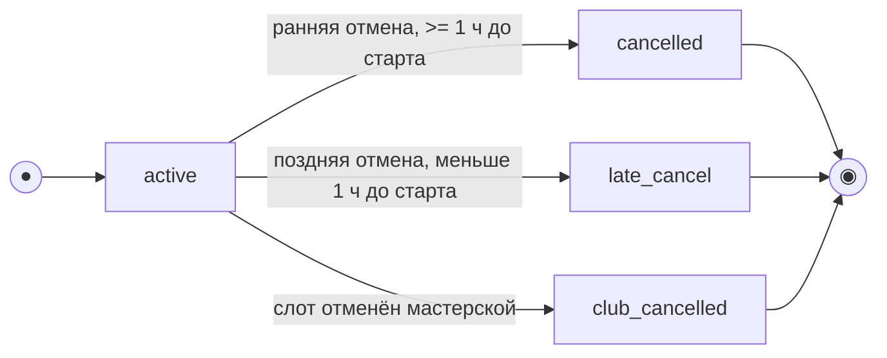
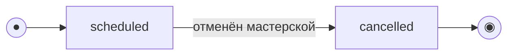

# Модель данных

> Этап 3. Проектирование. Описание сущностей, атрибутов, связей и черновик ERD.
>
> **Скоуп: клиентское приложение и API для него.** Это ресурсная модель API, а не физическая схема БД.
> Хранение данных и бизнес-логика принадлежат существующей инфраструктуре.
>
> - **Route, Instructor, Slot** — read-only-проекция ресурсов существующего бэкенда; клиент их не создаёт и не редактирует.
> - **Client, Booking** — ресурсы, которыми оперирует клиентский API.
> - Сущности оценок и рейтингов в скоуп не входят.
> - Модель ниже согласована с требованиями и доменом; легаси-данных в проекте нет, поэтому поля считаются каноническими.

**Источники:**
[Business requirements](../2-requirements/business-requirements.md) ·
[Functional requirements](../2-requirements/functional-requirements.md) ·
[Non-functional requirements](../2-requirements/non-functional-requirements.md) ·
[Use cases](../2-requirements/use-cases.md) ·
[User stories](../2-requirements/user-stories.md) ·
[Domain description](../1-elicitation/domain-description.md) ·
[SCR-001](../3-design-brief/SCR-001-registration.md) ·
[SCR-002](../3-design-brief/SCR-002-slot-list.md) ·
[SCR-003](../3-design-brief/SCR-003-slot-card.md) ·
[SCR-004](../3-design-brief/SCR-004-booking.md) ·
[SCR-005](../3-design-brief/SCR-005-my-bookings.md) ·
[SCR-006](../3-design-brief/SCR-006-booking-details.md)

## 1. Сущности и атрибуты

### Client (Клиент)
| Атрибут | Тип | Описание |
| :-- | :-- | :-- |
| id | UUID (PK) | Идентификатор клиента |
| name | string | Имя клиента |
| phone | string (unique) | Номер телефона — логин; вход подтверждается кодом из SMS |
| created_at | datetime | Дата регистрации |

> Вход и регистрация — поток с подтверждением по телефону; OTP не хранится отдельной сущностью в этой модели.

### Route (Маршрут) — справочник, read-only
| Атрибут | Тип | Описание |
| :-- | :-- | :-- |
| id | UUID (PK) | Идентификатор маршрута |
| name | string | Название маршрута |
| description | string? | Описательный текст для карточки слота |
| type | enum (`novice`/`experienced`) | Тип маршрута: новичковый / опытный |
| capacity_cap | int | Верхний предел мест для маршрута |
| duration_min | int | Длительность в минутах |
| geometry | polyline | Полилиния маршрута для карты |

### Instructor (Инструктор) — справочник, read-only
| Атрибут | Тип | Описание |
| :-- | :-- | :-- |
| id | UUID (PK) | Идентификатор инструктора |
| name | string | Имя инструктора |

### Slot (Слот / занятие) — read-only для клиента
| Атрибут | Тип | Описание |
| :-- | :-- | :-- |
| id | UUID (PK) | Идентификатор слота |
| route_id | FK → Route | Маршрут |
| instructor_id | FK → Instructor | Назначенный инструктор |
| start_at | datetime (UTC) | Дата и время старта; источник истины — сервер |
| total_seats | int | Всего мест |
| free_seats | int | Свободно мест |
| free_rental_boards | int | Свободно прокатных досок |
| price | money (RUB) | Цена за место |
| rental_price | money (RUB) | Цена проката за одну доску |
| meeting_point | string | Место встречи |
| meeting_point_lat | float | Широта точки встречи |
| meeting_point_lng | float | Долгота точки встречи |
| status | enum (`scheduled`/`cancelled`) | Статус слота |

### Booking (Запись / бронь)
| Атрибут | Тип | Описание |
| :-- | :-- | :-- |
| id | UUID (PK) | Идентификатор записи |
| slot_id | FK → Slot | Слот |
| client_id | FK → Client | Клиент |
| seats_count | int | Число мест в записи (1–3) |
| rental_count | int | Число мест на прокатной доске |
| status | enum (`active`/`cancelled`/`late_cancel`/`club_cancelled`) | Статус записи |
| price_total | money (RUB), read-only | Итоговая цена, возвращаемая сервером |
| created_at | datetime | Время создания |
| cancelled_at | datetime? | Время отмены |

> Оценки, рейтинг мастеров и отдельная сущность BookingSeat в текущий скоуп не входят.

## 2. ERD

## 3. Модель состояний и жизненный цикл

> Две сущности имеют явный жизненный цикл: **Booking** и **Slot**. Состояние «прошедшая» —
> производное отображение, вычисляемое по `start_at`, а не отдельное значение enum.

### Booking (Запись / бронь)

`status ∈ {active, cancelled, late_cancel, club_cancelled}`.

| Из | Событие / условие | В | Эффект |
| :-- | :-- | :-- | :-- |
| — | Клиент создаёт бронь | `active` | `free_seats -= seats_count`, `free_rental_boards -= rental_count` |
| `active` | Отмена не позднее чем за 1 час | `cancelled` | Места и доски возвращаются в слот |
| `active` | Отмена позже допустимого срока | `late_cancel` | Место и доска не освобождаются |
| `active` | Слот отменён мастерской | `club_cancelled` | Запись закрыта не по инициативе клиента |

### Slot (Слот / занятие)

`status ∈ {scheduled, cancelled}`.

| Статус | Что видит клиент | Запись |
| :-- | :-- | :-- |
| `scheduled` | Слот в списке и карточке | Доступна при наличии свободных мест |
| `scheduled` в прошлом | Производное состояние «прошедшая» | Недоступна для новой записи |
| `cancelled` | Пометка о недоступности | Недоступна |

## 4. Ключевые инварианты

- `Slot.total_seats <= Route.capacity_cap`.
- `Booking.seats_count` ограничен сценарием записи и правилами приложения.
- `Slot.free_seats` и `Slot.free_rental_boards` обновляются атомарно при создании и отмене брони.
- Клиент не пересчитывает `price_total`; он отображает значение, возвращённое API.
- Повторная запись на отменённый мастерской слот запрещена.
- Повторная отмена одной и той же брони не выполняется.

## 5. Связь с интерфейсом

- [SCR-001](../3-design-brief/SCR-001-registration.md) использует `Client`.
- [SCR-002](../3-design-brief/SCR-002-slot-list.md) и [SCR-003](../3-design-brief/SCR-003-slot-card.md) используют `Slot`, `Route`, `Instructor`.
- [SCR-004](../3-design-brief/SCR-004-booking.md) использует `Slot` и создаёт `Booking`.
- [SCR-005](../3-design-brief/SCR-005-my-bookings.md) и [SCR-006](../3-design-brief/SCR-006-booking-details.md) используют `Booking`.
