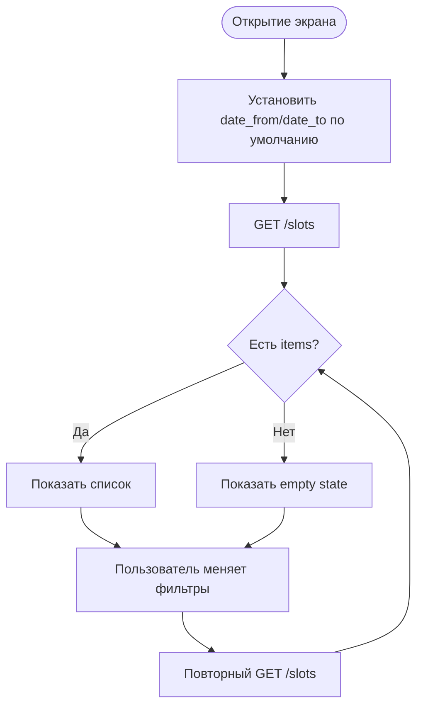

# Загрузка и фильтрация списка слотов

**ID:** LOGIC-001
**Тип:** Логика
**Домен:** 09. Логики
**Приоритет:** Critical
**Статус:** Черновик
**Функциональные блоки:** FB-SLOTS-001, FB-SLOTS-002

## История изменений

| Релиз | ТЗ | Описание изменений |
|-------|-----|-------------------|
| — | — | Первоначальная документация |

## Входные данные

| Название | Тип | Возможные значения | Описание |
|----------|-----|-------------------|----------|
| `date_from` | Состояние | datetime | Начало диапазона |
| `date_to` | Состояние | datetime | Конец диапазона |
| `route_type` | Состояние | `novice`, `experienced` | Тип маршрута |
| `instructor_id` | Состояние | UUID | Фильтр по мастеру |
| `only_available` | Состояние | `true` / `false` | Только свободные слоты |

## Обзор

Логика отвечает за загрузку списка слотов по умолчанию на ближайшие 7 дней и за применение фильтров без перехода на другой экран.

### User Story

> Как клиент, я хочу видеть слоты на ближайшие 7 дней и уточнять их фильтрами,
> чтобы быстро находить подходящее занятие.

### Бизнес-ценность

- Снижает количество лишних шагов при выборе занятия.
- Делает выдачу слотов управляемой и предсказуемой.
- Поддерживает правило показывать только свободные слоты.

## Точки применения

| Экран/Компонент | Элемент/Триггер | Условие |
|-----------------|-----------------|---------|
| [SCR-002-slot-list.md](SCR-002-slot-list.md) | При открытии | Всегда |
| [BS-001-filters.md](BS-001-filters.md) | Нажатие «Применить» | При изменении параметров |

## Флоу

## Описание логики

### Шаг 1: Инициализация параметров

По умолчанию `date_from` берётся как текущий момент, `date_to` как текущий момент плюс 7 дней. `only_available` выключен, если пользователь отдельно его не включил.

### Шаг 2: Загрузка данных

Логика вызывает `GET /slots` и получает постраничный список слотов. Для фильтра мастера при необходимости используется справочник `GET /instructors`.

### Шаг 3: Обработка пустой выдачи

Если `items` пуст, экран списка получает empty state. Если пустота возникла после применения фильтров, пользователь должен увидеть подсказку изменить или сбросить параметры.

## API запросы

### GET /slots

**Триггер:** открытие экрана и применение фильтров.

**Параметры:** `date_from`, `date_to`, `route_type`, `instructor_id`, `only_available`, `limit`, `offset`.

**Обработка ответа:**

| Результат | Действие |
|-----------|----------|
| `200` | Отдать список в UI |
| `400` | Показать ошибку параметров |
| `401` | Переход на вход |
| `5xx` | Показать ошибку и возможность повторить |

## Локальное хранение

| Ключ | Тип хранения | Описание |
|------|--------------|----------|
| `slot_filters` | Локальный кэш | Последние выбранные фильтры |

## Связанные требования

### Функциональные (REQ-FUNC-*)

| ID | Название | Приоритет |
|----|----------|-----------|
| FR-005 | Показ слотов на ближайшие 7 дней | Critical |
| FR-006 | Фильтрация по датам | High |
| FR-008 | Empty state при отсутствии слотов | High |

### Интеграции (REQ-INT-*)

| ID | Название | Приоритет |
|----|----------|-----------|
| GET /slots | Список слотов | Critical |

## Критерии приёмки

| ID | Критерий |
|----|----------|
| AC-001 | **Дано** экран списка открыт, **Когда** фильтры не заданы, **Тогда** загружаются слоты на ближайшие 7 дней |
| AC-002 | **Дано** фильтры изменены, **Когда** пользователь нажимает «Применить», **Тогда** список перезагружается с новыми параметрами |
| AC-003 | **Дано** по фильтрам нет результатов, **Когда** ответ API пустой, **Тогда** UI показывает empty state |
