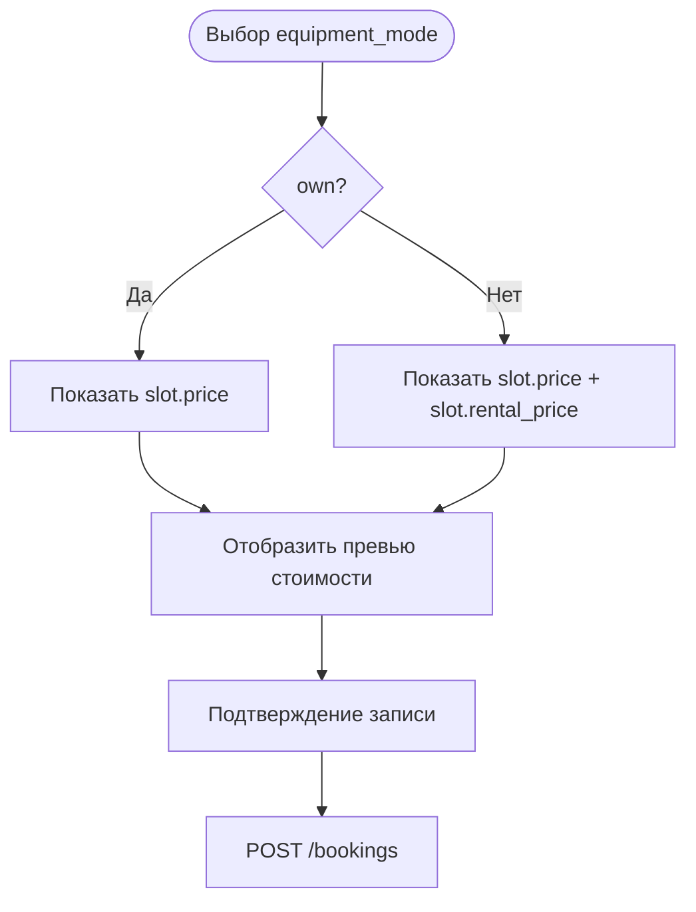

# Расчёт итоговой стоимости записи

**ID:** LOGIC-002
**Тип:** Логика
**Домен:** 09. Логики
**Приоритет:** High
**Статус:** Черновик
**Функциональные блоки:** FB-BOOKING-001, FB-BOOKING-002

## История изменений

| Релиз | ТЗ | Описание изменений |
|-------|-----|-------------------|
| — | — | Первоначальная документация |

## Входные данные

| Название | Тип | Возможные значения | Описание |
|----------|-----|-------------------|----------|
| `slot.price` | Состояние | int | Цена занятия |
| `slot.rental_price` | Состояние | int | Цена проката |
| `equipment_mode` | Состояние | `own`, `rental` | Выбранный способ участия |

## Обзор

Логика показывает клиенту итоговую стоимость до подтверждения записи и не допускает расхождения между превью и ответом сервера по основному сценарию.

### User Story

> Как клиент, я хочу видеть итоговую стоимость до подтверждения записи,
> чтобы принять решение до отправки запроса.

### Бизнес-ценность

- Снижает риск неожиданной суммы после подтверждения.
- Делает сценарий записи прозрачным.
- Поддерживает правило показывать цену до подтверждения бронирования.

## Точки применения

| Экран/Компонент | Элемент/Триггер | Условие |
|-----------------|-----------------|---------|
| [SCR-004-booking.md](SCR-004-booking.md) | Переключение `equipment_mode` | Всегда |
| [BS-002-booking-success.md](BS-002-booking-success.md) | После успешного ответа | Для отображения итогового результата |

## Флоу

## Описание логики

### Шаг 1: Выбор режима участия

Если клиент выбирает `own`, показывается только цена занятия. Если выбирает `rental`, добавляется стоимость проката.

### Шаг 2: Предварительный расчёт

Клиент показывает предварительную стоимость до отправки запроса. Финальное значение `price_total` приходит в ответе `POST /bookings` и должно совпасть с отображённым сценарием.

### Шаг 3: Подтверждение

После успешного `201` пользователь видит экран успеха, где уже используется серверный результат.

## API запросы

### POST /bookings

**Триггер:** подтверждение записи.

**Параметры/Body:** `slot_id`, `equipment_mode`, `Idempotency-Key`.

**Обработка ответа:**

| Результат | Действие |
|-----------|----------|
| `201` | Отобразить `price_total` и подтвердить бронь |
| `409` | Показать, что мест нет или возник конфликт |
| `410` | Показать, что слот отменён мастерской |

## Связанные требования

### Функциональные (REQ-FUNC-*)

| ID | Название | Приоритет |
|----|----------|-----------|
| FR-012 | Показ стоимости до подтверждения | Critical |
| FR-013 | Отправка запроса на бронирование | Critical |
| FR-014 | Отказ при отсутствии мест | Critical |
| FR-015 | Подтверждение записи | Critical |

## Критерии приёмки

| ID | Критерий |
|----|----------|
| AC-001 | **Дано** выбран `own`, **Когда** показывается превью, **Тогда** отображается цена занятия |
| AC-002 | **Дано** выбран `rental`, **Когда** показывается превью, **Тогда** отображается цена занятия с прокатом |
| AC-003 | **Дано** сервер вернул `price_total`, **Когда** бронь создана, **Тогда** UI использует серверный результат как финальный |
