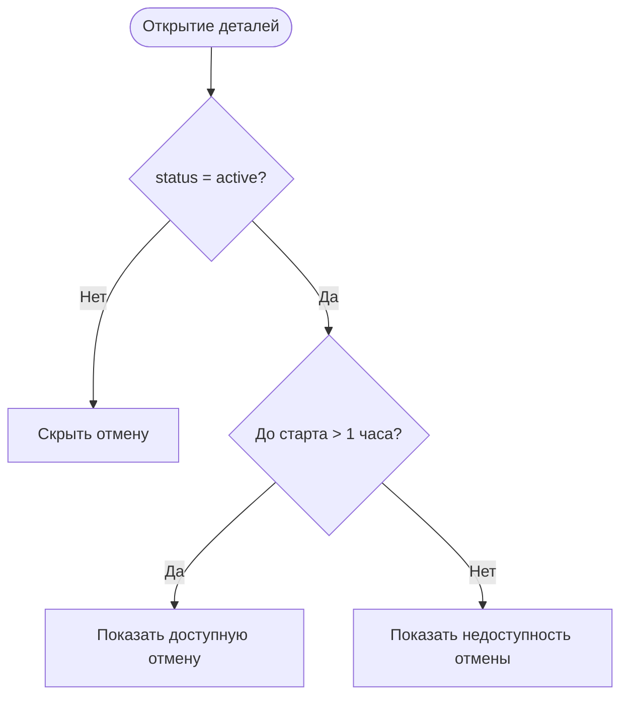

# Доступность отмены записи

**ID:** LOGIC-003
**Тип:** Логика
**Домен:** 09. Логики
**Приоритет:** Critical
**Статус:** Черновик
**Функциональные блоки:** FB-BOOKING-003, FB-BOOKING-004

## История изменений

| Релиз | ТЗ | Описание изменений |
|-------|-----|-------------------|
| — | — | Первоначальная документация |

## Входные данные

| Название | Тип | Возможные значения | Описание |
|----------|-----|-------------------|----------|
| `booking.status` | Состояние | `active`, `cancelled`, `late_cancel`, `club_cancelled` | Статус брони |
| `slot.start_at` | Состояние | datetime | Время начала занятия |
| `now` | Состояние | datetime | Текущее время устройства/сервера для UI-проверки |

## Обзор

Логика определяет, можно ли отменить бронь на клиенте до отправки запроса. Сервер всё равно остаётся финальным арбитром, но UI должен заранее скрывать или блокировать недоступное действие.

### User Story

> Как клиент, я хочу видеть, доступна ли отмена записи,
> чтобы не пытаться выполнить действие после дедлайна.

### Бизнес-ценность

- Убирает ложные ожидания.
- Снижает число бесполезных запросов к API.
- Делает правило 1 часа понятным в интерфейсе.

## Точки применения

| Экран/Компонент | Элемент/Триггер | Условие |
|-----------------|-----------------|---------|
| [SCR-006-booking-details.md](SCR-006-booking-details.md) | При открытии экрана | Всегда |
| [BS-003-cancel-confirm.md](BS-003-cancel-confirm.md) | При открытии шторки | Если статус `active` |

## Флоу

## Описание логики

### Шаг 1: Проверка статуса

Отмена доступна только для брони в статусе `active`. Для `cancelled`, `late_cancel` и `club_cancelled` действие недоступно.

### Шаг 2: Проверка времени

Если до `slot.start_at` остаётся не более 1 часа, клиент блокирует подтверждение отмены и показывает причину недоступности.

### Шаг 3: Отправка запроса

Если отмена доступна, UI открывает шторку подтверждения и затем отправляет `POST /bookings/{bookingId}/cancel`.

## API запросы

### POST /bookings/{bookingId}/cancel

**Триггер:** подтверждение отмены.

**Обработка ответа:**

| Результат | Действие |
|-----------|----------|
| `200` | Обновить статус и список |
| `422` | Показать, что отмена недоступна после начала занятия |
| `409` | Показать, что бронь уже отменена |

## Связанные требования

### Функциональные (REQ-FUNC-*)

| ID | Название | Приоритет |
|----|----------|-----------|
| FR-021 | Отмена не позднее чем за 1 час | Critical |
| FR-022 | Сообщение о недоступности отмены | Critical |
| FR-023 | Обновление статуса после отмены | High |

## Критерии приёмки

| ID | Критерий |
|----|----------|
| AC-001 | **Дано** у брони статус `active` и до старта больше 1 часа, **Когда** открыты детали, **Тогда** отмена доступна |
| AC-002 | **Дано** до старта меньше 1 часа, **Когда** открыты детали или шторка отмены, **Тогда** действие недоступно |
| AC-003 | **Дано** отмена подтверждена, **Когда** сервер вернул `200`, **Тогда** статус обновляется в списке и деталях |
