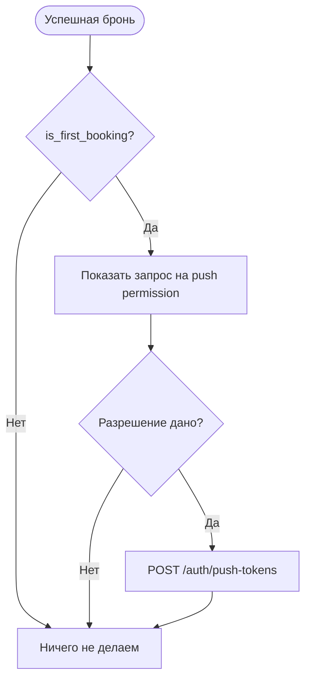

# Регистрация push-токена

**ID:** LOGIC-004
**Тип:** Логика
**Домен:** 09. Логики
**Приоритет:** High
**Статус:** Черновик
**Функциональные блоки:** FB-NOTIFY-001, FB-NOTIFY-002

## История изменений

| Релиз | ТЗ | Описание изменений |
|-------|-----|-------------------|
| — | — | Первоначальная документация |

## Входные данные

| Название | Тип | Возможные значения | Описание |
|----------|-----|-------------------|----------|
| `is_first_booking` | Состояние | `true` / `false` | Признак первой успешной брони |
| `push_token` | Защищённое хранилище | string | Токен push-уведомлений устройства |
| `platform` | Защищённое хранилище | `ios`, `android` | Платформа устройства |

## Обзор

Логика отвечает за регистрацию push-токена после первой успешной брони, чтобы клиент начал получать подтверждения, напоминания и сообщения об отмене от мастерской.

### User Story

> Как клиент, я хочу получать push-уведомления о записи и изменениях,
> чтобы не пропустить важные события.

### Бизнес-ценность

- Повышает доходимость на занятия.
- Делает уведомления управляемыми на уровне приложения.
- Поддерживает первый сценарий включения push после успешной брони.

## Точки применения

| Экран/Компонент | Элемент/Триггер | Условие |
|-----------------|-----------------|---------|
| [BS-002-booking-success.md](BS-002-booking-success.md) | После успешной первой брони | `is_first_booking = true` |
| [SCR-001-registration.md](SCR-001-registration.md) | Вход в приложение | При восстановлении сессии |

## Флоу

## Описание логики

### Шаг 1: Проверка признака первой брони

Если сервер возвращает `is_first_booking = true`, приложение готовит сценарий подключения push-уведомлений.

### Шаг 2: Регистрация токена

После получения разрешения на push приложение вызывает `POST /auth/push-tokens` с токеном платформы и типом устройства.

### Шаг 3: Удаление токена

При выходе из аккаунта или отключении уведомлений токен может быть удалён через `DELETE /auth/push-tokens`.

## API запросы

### POST /auth/push-tokens

**Триггер:** пользователь дал разрешение на push.

**Обработка ответа:**

| Результат | Действие |
|-----------|----------|
| `204` | Токен зарегистрирован |
| `400` | Показать ошибку токена |
| `401` | Переход на вход |

### DELETE /auth/push-tokens

**Триггер:** выход из аккаунта или отключение уведомлений.

## Связанные требования

### Функциональные (REQ-FUNC-*)

| ID | Название | Приоритет |
|----|----------|-----------|
| FR-024 | Push о подтверждении записи | High |
| FR-025 | Напоминания о занятии | High |
| FR-026 | Сообщение в приложении об отмене мастерской | High |
| FR-027 | Push об отмене мастерской | High |

## Критерии приёмки

| ID | Критерий |
|----|----------|
| AC-001 | **Дано** первая бронь подтверждена, **Когда** пользователь дал разрешение на push, **Тогда** приложение регистрирует push-токен |
| AC-002 | **Дано** пользователь вышел из аккаунта, **Когда** push-токен удаляется, **Тогда** приложение вызывает `DELETE /auth/push-tokens` |
