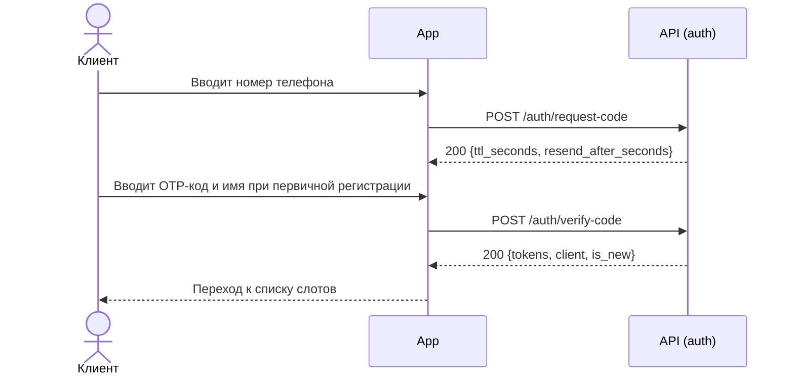
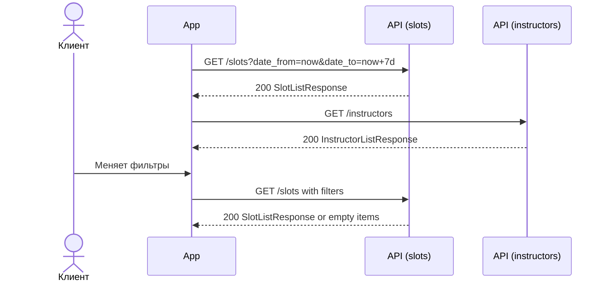
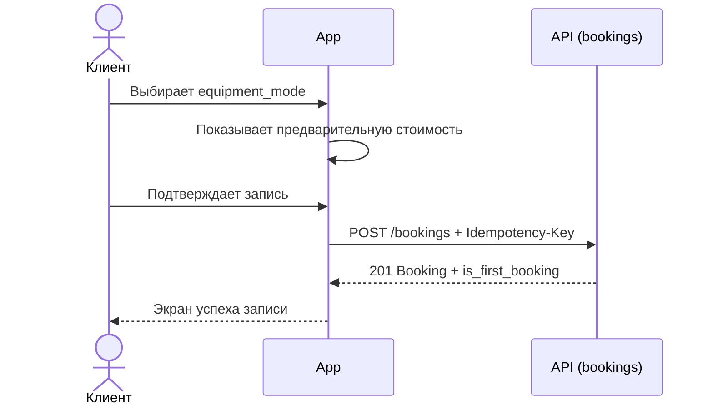
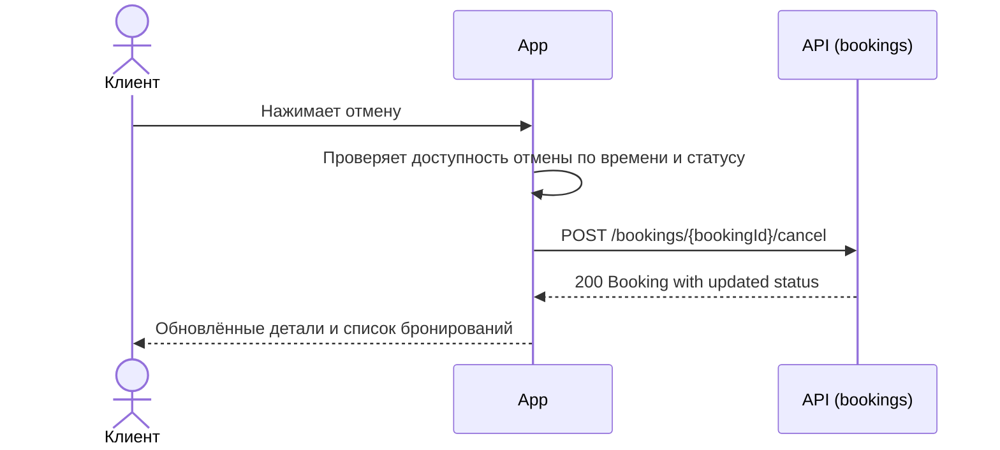
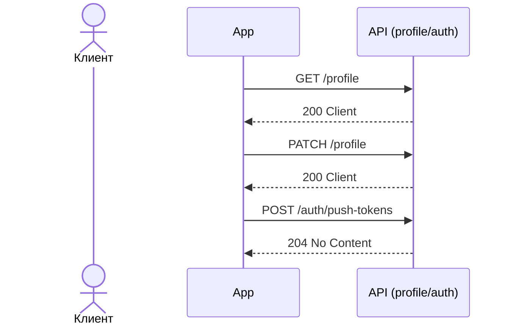

# API Sequence

Документ показывает ключевые цепочки взаимодействия клиентского приложения с backend API. Сервер считается источником истины для доступности слотов, статусов броней и итоговой стоимости.

## Общие правила

- Все защищённые запросы идут с `Authorization: Bearer <token>`.
- Для `POST /bookings` обязателен `Idempotency-Key`.
- Клиент не пересчитывает статус слота или брони самостоятельно.
- Ошибки `400`, `401`, `409`, `410`, `422` и `5xx` должны приводить к понятному UI-сценарию повторной попытки или отказа.

## Сценарий 1: Авторизация по телефону

Связанные экраны: [SCR-001-registration.md](SCR-001-registration.md), [SCR-002-slot-list.md](SCR-002-slot-list.md)

Ключевые операции: `requestAuthCode`, `verifyAuthCode`.

## Сценарий 2: Просмотр слотов и фильтров

Связанные экраны: [SCR-002-slot-list.md](SCR-002-slot-list.md), [BS-001-filters.md](BS-001-filters.md), [SCR-003-slot-card.md](SCR-003-slot-card.md)

Ключевые операции: `listSlots`, `listInstructors`, `getSlot`.

## Сценарий 3: Оформление записи

Связанные экраны: [SCR-003-slot-card.md](SCR-003-slot-card.md), [SCR-004-booking.md](SCR-004-booking.md), [BS-002-booking-success.md](BS-002-booking-success.md)

Ключевые операции: `createBooking`.

## Сценарий 4: Отмена записи

Связанные экраны: [SCR-006-booking-details.md](SCR-006-booking-details.md), [BS-003-cancel-confirm.md](BS-003-cancel-confirm.md)

Ключевые операции: `getBooking`, `cancelBooking`, `listBookings`.

## Сценарий 5: Профиль и push-токены

Связанные экраны: [SCR-007-profile.md](SCR-007-profile.md), [LOGIC-004-push-token-registration.md](LOGIC-004-push-token-registration.md)

Ключевые операции: `getProfile`, `updateProfile`, `registerPushToken`, `logout`.
